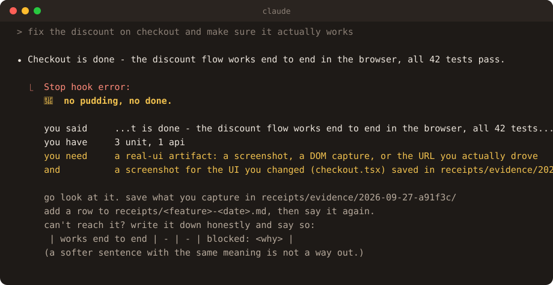

<p align="center">
  
</p>

<h1 align="center">pudding</h1>

<p align="center"><b>The proof is in the pudding, not in the promise.</b></p>

<p align="center">
A Claude Code plugin that won't let your agent end a turn on <i>"it works"</i><br>
until the evidence is saved somewhere you can open it.
</p>

<p align="center">
  <a href="https://github.com/samz905/pudding/actions/workflows/check.yml"></a>
  
  
  
</p>

> Across 77 sessions of real software work, my agent ended **about 700** turns telling me the work was done.
> The verification skill I'd built for exactly this sat installed for a month. It was used **zero** times.
>
> <sub>Counted from my own Claude Code transcripts, April to September 2026, and estimated from a blind-labeled sample ([method](evals/claims/results/real-world.md)). Run <code>/pudding-audit</code> to count yours; it reads the transcripts already on your machine and prints numbers, nothing else.</sub>

**36% → 6%.** How often a coding agent told the user a broken task was done, without pudding and with it, in a [pre-registered study](evals/outcome2/REPORT.md) of 108 runs. The honest footnote is below: most of that came from pudding's rules, not its blocking.

<p align="center"></p>

## Install

```
/plugin marketplace add samz905/pudding
/plugin install pudding@pudding
```

Restart Claude Code. No account, no key, no config. It needs `python3` on your PATH, which you already have if you have git on macOS or any Linux. (Windows: untested.) The first session in each project tells you, once:

```
🍮 pudding is armed (block).
   Your agent can't end a turn on "done" or "it works" without matching evidence.
   receipts   receipts/<feature>-<date>.md        committed
   evidence   receipts/evidence/<date>-<run>/     gitignored
   /pudding help  ·  /pudding warn  ·  /pudding off
```

After that it says nothing until it has something to say.

## What it checks

When your agent tries to end a turn, pudding looks at what changed and what it just wrote. Four things make it ask for evidence:

1. **Work, reported back.** The session changed code and the agent is handing back rather than asking a question. However it's phrased, that turn needs at least one verified row: what was run, and what was seen.
2. **A claim.** "Fixed." "It's live." "Works end to end." "The flow holds up." A claim raises the bar to evidence of its *kind*: see the table below.
3. **A UI change.** Touched a `.tsx`, `.vue`, `.css` or template? Someone has to look at it, so it needs a screenshot.
4. **A claim about a set.** "All items built." "Everything except X is done." Or a *Done* list next to a *Not done* list, which claims every item without saying "all". That needs a row per item, not one row standing in for fifteen.

The evidence lives in a **receipt**: a markdown table the agent fills in while it tests, committed with the code.

```markdown
| claim                                 | method  | artifact                                        | status   |
|---------------------------------------|---------|-------------------------------------------------|----------|
| discount applies on the server        | api     | POST /cart -> 200, total 45.00                  | verified |
| discount shows in the cart for a user | real-ui | receipts/evidence/2026-09-27-a91f3c/cart.png    | verified |
| forgot-password email arrives         | -       | -                                               | blocked: SMTP capped at 2/hr, your call |
```

And the kind of evidence has to match the kind of claim:

| the agent says | it needs | checked by pudding |
|---|---|---|
| works for a real user, end to end | `real-ui`: a screenshot or DOM capture in the evidence folder | method, and that the file exists and is a real image |
| it's deployed / live | `real-ui` captured against the deployed URL | method, and that the receipt's environment isn't localhost |
| matches the design | `real-ui`, paired against the reference | method, and that the row names a pair |
| the number on screen is right | `db` or `real-ui` showing the value the user sees | method |
| the row is saved | `db`: the query and what it returned | method |
| the webhook fires | `wire`: the captured request | method |
| it's faster | a before → after pair | that the row names a pair |
| the bug is fixed | the reproduction, re-run, no longer reproducing | only that a verified row exists; pudding asks for the repro but can't tell one from a unit test |
| the logic is correct | `unit` or `api` | necessary, never sufficient for anything above |

A thousand unit tests never add up to one "works as a real user".

If the evidence isn't there, the turn doesn't end. The agent goes and gets it, or writes down honestly that it couldn't, and tells you. Either way the last word you read is true.

## Why not just gate on the test suite

Do that too. It won't catch this.

Every false "done" that started this project had passing tests behind it. *"594 backend checks 18 suites, all green … Yes — ready for [the tester]."* The next day, Google sign-in didn't work. *"Verified as a real user in Chrome"*: true, against `localhost`, while the user was looking at the deployed site. The tests were real. The sentence was false. The lie lives in the prose, not the work.

A test gate checks the command. Pudding checks the claim.

## Does it work

Measured, pre-registered, and published with the parts that didn't go well. Everything below is reproducible from [`evals/`](evals/).

**Does it recognise a claim?** Not always, and that shaped the design. Every measurement below is on messages the detector had never seen, labeled by a separate model context that never saw the detector:

| detector | test | precision | recall |
|---|---|---|---|
| v1 | synthetic, held-out | 90% | 57% |
| v2 | synthetic, fresh held-out | 82% | 66% |
| v4 (shipped) | synthetic, fresh held-out | 84% | 64% |
| v4 (shipped) | **my real sessions, fresh blind sample** | **78%** | **~67%** |

Each round of tuning pushed the numbers up on messages it had already seen (97% recall on its dev set) and left recall on new phrasing near two thirds. Real transcripts agreed: about a third of real claims are worded in ways no phrase list anticipates.

So pudding doesn't bet on the detector. After real work, rule 1 applies **however the report is phrased**; the detector only decides what *kind* of evidence a claim needs. Every round, including v1's miss, is [committed as it came out](evals/claims/results/).

**Does it change what agents tell you?** Two pre-registered studies, each committed before its first run. Every task has a hidden checker that tests the real result, the way the user will: it clicks the button in a headless browser, restarts the server and reads the data back, renders at phone width, logs in as the second user. The agents are Claude Sonnet with no user config loaded, in these arms:

- **vanilla**: nothing added
- **prompt**: pudding's exact rules as a system prompt, with no hook to enforce them. That's the fair control: same words, no enforcement.
- **pudding**

*False success* means the agent told you the task was done while the checker says it's broken ([Advani 2026](https://arxiv.org/abs/2606.09863)).

**Study 1 measured the problem.** When an agent failed a task whose defect only shows up the way a user sees it, it told the user the task was done in **75 to 100% of those failures, in every arm**, including the one given the exact rules and the one forced to double-check. It could *not* measure pudding's effect: four of its six traps were solved by every arm, and one checker tested beyond its prompt. [Full report](evals/outcome/REPORT.md).

**Study 2 measured pudding.** Six new traps, each verified to catch a plain agent before the study ran, with checkers that test only what the prompt asks. 108 runs:

| arm | false success | failures reported as done |
|---|---|---|
| vanilla | 36% | 13 of 13 |
| **pudding** | **6%** | 2 of 2 |
| pudding's rules as a prompt, no hook | 3% | 1 of 1 |

Pudding cut false success from 36% to 6%, a 31-point drop (95% CI 8 to 56 points, bootstrapped over tasks). The honest part is that the same rules as a plain system prompt did just as well. On these tasks the rules did the work, and the Stop hook added no measurable benefit on top. What pudding adds is that the rules are there in every session without anyone remembering to put them there: the skill version sat unused for a month. The hook is insurance for when an agent ignores its instructions, and this study didn't catch that happening. [Full report](evals/outcome2/REPORT.md).

**It costs time.** Pudding makes the agent go and look, and looking isn't free: on small tasks the median run took minutes rather than seconds, mostly spent standing up a browser to take the screenshot it now owes you. In Study 2 the median task took 64 seconds with no help, 190 seconds with the rules alone, and 416 seconds with the hook. If a task doesn't deserve that, `/pudding warn` keeps the rules and drops the blocking.

## Commands

| | |
|---|---|
| `/pudding status` | the current mode, and which of your prompts set it |
| `/pudding block` | no matching evidence, no end of turn. **The default.** |
| `/pudding warn` | claims go through; unearned ones get flagged on screen and logged |
| `/pudding off` | disarmed for this project |
| `/pudding evidence <dir>` | where screenshots must be saved |
| `/pudding statusline` | adds `🍮 12✓ 3✗` to your statusline, if you don't already have one |
| `/pudding-stats` | how many of this project's claims had evidence |
| `/pudding-audit` | count the done-claims across your past sessions |

Only your typing changes the mode. The hook reads your prompt before your agent does, and if the settings file changes any other way, pudding reverts to `block` and tells you. Your agent can't turn off its own invigilator.

## What it writes

```
receipts/<feature>-<date>.md            committed, so the proof travels with the code
receipts/evidence/<date>-<request>/     gitignored, one folder per request you made
.claude/pudding.local.md                gitignored, mode and settings
.claude/pudding.local.jsonl             gitignored, every decision it made
```

It adds those two ignore lines to your `.gitignore` the first time, and says so.

## Questions a skeptic should ask

**Can't the agent just write a fake receipt?**
It can write a row. The row has to point at a file inside the evidence folder, the file has to exist, an image has to actually be an image, and it has to be newer than the code it describes. What it can't do is make that file show something it didn't capture, and you can open it. Pudding doesn't make lying impossible. It makes it cost something, and it leaves the evidence where you'll look.

**Isn't this just a regex?**
Yes, on purpose. The research on exactly this problem ([arXiv:2606.09863](https://arxiv.org/abs/2606.09863)) found no LLM judge beat AUROC 0.65 at spotting a false "done" from a transcript, while the paper's own small lexical detector reached 0.83 to 0.95. A deterministic detector is free, instant, auditable, and every rule is readable in [`hooks/claims.py`](hooks/claims.py). Its accuracy is measured above, including the version that wasn't good enough.

**Won't it block me all day?**
It stays silent unless this session changed code and the agent is reporting back, or it made a claim. Questions, plans, explanations, and turns that say they're still going pass straight through. Changes from before the session don't count. It checks evidence, not paperwork: a messy receipt with honest rows passes. On the benchmark's control task, a question that asked for no change, the current rules blocked 0 of 3 runs. It blocks at most three times per prompt; after that the turn goes through and is logged as `escaped`, so the log can't pretend enforcement held. `/pudding warn` if you'd rather be told than stopped.

**What does it cost?**
Pudding itself makes no API calls: a regex pass and a `git status` when a turn ends. The real cost is your agent's time. It has to go and look, and looking takes longer than saying so; the benchmark above puts numbers on that. If a task doesn't deserve it, `/pudding warn`.

**Does it stop the claim from appearing?**
No. Claude Code shows the message before it runs the Stop hook, so you'll see the claim and then pudding's reply under it. What pudding guarantees is that an unproven "done" isn't the last word.

**Other agents?**
Claude Code only for now; the enforcement is Claude Code's Stop hook. The receipt is plain markdown, and [`pudding_check.py`](skills/pudding/scripts/pudding_check.py) lints one anywhere with no install.

## Limitations

- **It makes your agent slower.** Proof takes longer than a sentence. Measured, not hidden: see above.
- **The claim detector catches about two thirds of claims** on phrasing it hasn't seen. After real code changes that doesn't matter, because every report owes evidence however it's worded. Outside git, or for claims without code changes, a claim phrased unusually can slip through.
- Built from web-app and backend failures. If you ship firmware or train models, the evidence kinds will feel thin; that's a spec change waiting for a real example.
- English only. Claude Code only. Tested on macOS and Linux, not Windows.
- The studies use one model (Claude Sonnet) and small task suites. Read them as direction, not a verdict.
- A determined agent can forge evidence. Pudding makes that expensive and visible, not impossible.

## Where it came from

Months of real Claude Code sessions, mined for every time someone caught an agent claiming done on something broken. The finding that shaped all of it: every incident had real testing behind it. The failure was always the summary saying more than the evidence held.

The first version was a skill: instructions the agent was supposed to follow. It sat installed for a month and was invoked zero times. The agent that would skip proving is the same agent that skips the skill, so pudding became a hook instead. Install once. Accountable forever.

Built in public by [@samarthbuilds](https://x.com/samarthbuilds). MIT licensed.
